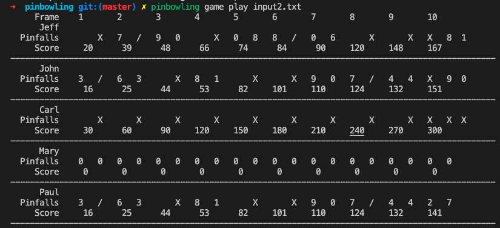

[![Contributors][contributors-shield]][contributors-url]
[![Forks][forks-shield]][forks-url]
[![Stargazers][stars-shield]][stars-url]
[![Issues][issues-shield]][issues-url]
[![LinkedIn][linkedin-shield2]][linkedin-url2]
[![Hireable][hireable]][hireable-url]

<br />
<p align="center">
 <h2 align="center">Pinbowling</h2>

  <p align="center">
    Ruby command line application to play pinbowling game.
    <br />
    <a href="https://github.com/YairFernando67/pinbowling"><strong>Explore the docs »</strong></a>
    <br />
    <br />
    <a href="https://github.com/YairFernando67/pinbowling">View demo</a>
    ·
    <a href="https://github.com/YairFernando67/pinbowling/issues">Report bug</a>
    ·
    <a href="https://github.com/YairFernando67/pinbowling/issues">Request feature</a>
  </p>

</p>

## Installation

You can install this gem using [specific_install](https://github.com/rdp/specific_install)


```ruby
$ gem install specific_install
```

Then run this command to install pinbowling gem
```ruby
gem specific_install -l https://github.com/YairFernando67/pinbowling.git
```

## Usage

### Check version
After installing you can check the version
```ruby
$ pinbowling -v
```
### Read instructions
Before you start playing check out the instructions using the support command
```ruby
$ pinbowling support play
```
### Start a game
Provide a .txt file with your players and scores and run the following command to see the results.
```ruby
$ pinbowling game play input.txt
```




## Development

After checking out the repo, run `bin/setup` to install dependencies. You can also run `bin/console` for an interactive prompt that will allow you to experiment.

To install this gem onto your local machine, run `bundle exec rake install`. To release a new version, update the version number in `version.rb`, and then run `bundle exec rake release`, which will create a git tag for the version, push git commits and tags, and push the `.gem` file to [rubygems.org](https://rubygems.org).

## Contributing

Bug reports and pull requests are welcome on GitHub at https://github.com/[USERNAME]/pinbowling. This project is intended to be a safe, welcoming space for collaboration, and contributors are expected to adhere to the [code of conduct](https://github.com/[USERNAME]/pinbowling/blob/master/CODE_OF_CONDUCT.md).


## License

The gem is available as open source under the terms of the [MIT License](https://opensource.org/licenses/MIT).

## Code of Conduct

Everyone interacting in the Pinbowling project's codebases, issue trackers, chat rooms and mailing lists is expected to follow the [code of conduct](https://github.com/[USERNAME]/pinbowling/blob/master/CODE_OF_CONDUCT.md).

## Show your support

Give a ⭐️ if you like this project!

[contributors-shield]: https://img.shields.io/github/contributors/YairFernando67/pinbowling.svg?style=flat-square
[contributors-url]: https://github.com/YairFernando67/pinbowling/graphs/contributors
[forks-shield]: https://img.shields.io/github/forks/YairFernando67/pinbowling.svg?style=flat-square
[forks-url]: https://github.com/YairFernando67/pinbowling/network/members
[stars-shield]: https://img.shields.io/github/stars/YairFernando67/pinbowling.svg?style=flat-square
[stars-url]: https://github.com/YairFernando67/pinbowling/stargazers
[issues-shield]: https://img.shields.io/github/issues/YairFernando67/pinbowling.svg?style=flat-square
[issues-url]: https://github.com/YairFernando67/pinbowling/issues
[license-shield]: https://img.shields.io/github/license/YairFernando67/pinbowling.svg?style=flat-square
[license-url]: https://github.com/YairFernando67/pinbowling/blob/master/LICENSE.txt
[linkedin-shield2]: https://img.shields.io/badge/-LinkedIn-black.svg?style=flat-square&logo=linkedin&colorB=555
[linkedin-url2]: https://www.linkedin.com/in/softwaredeveloperyairfacio/
[hireable]: https://cdn.rawgit.com/hiendv/hireable/master/styles/flat/yes.svg
[hireable-url]: https://www.linkedin.com/in/softwaredeveloperyairfacio/
